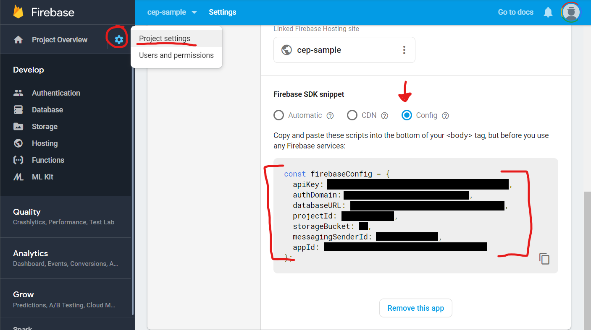

# leylo [](https://badge.fury.io/js/leylo) [](https://snyk.io/test/github/Inventsable/leylo)

Asynchronous utility functions for [Firestore](https://firebase.google.com/docs/firestore/quickstart) within [Vue CLI 3](https://cli.vuejs.org/).

## Installation

```bash
npm install leylo
```

If not using Firebase Hosting, there's no need to `npm install firebase` or `npm install firebase-tools`. Just plug in the credentials within your `.env` and you're good to go!

---

## Requirements

You must have a `.env` file at the root of your Vue CLI 3 repo containing the following key/value pairs:

```env
VUE_APP_FIREBASE_KEY=...
VUE_APP_FIREBASE_AUTHDOMAIN=...
VUE_APP_FIREBASE_DATABASEURL=...
VUE_APP_PROJECTID=...
VUE_APP_FIREBASE_BUCKET=...
VUE_APP_MESSAGINGSENDERID=...
VUE_APP_ID=...
```



No quotation marks needed in `.env` the above

---

## Usage

```html
<script>
  // Within a .vue file
  import leylo from "leylo";

  export default {
    name: "yourComponent",
    // If using async/await, must define mounted/created/function as async
    async mounted() {
      let validation = await leylo.docExists("users", "Inventsable");
      console.log(validation); //  Returns true

      // All functions are thenable if not using async
      leylo.getDocById("users", "Inventsable").then(response => {
        console.log(response); //  Returns { name: 'Tom Scharstein', ... }
      });
    }
  };
</script>
```

---

# API

All methods are accessible as properties of `leylo`, as in `leylo.docExists(...)`.

## Global

### `.db`

Returns `Object` of interior `Firestore` used for all queries.

```js
let db = leylo.db;
console.log(db);
// Returns Firestore {_queue: AsyncQueue, INTERNAL: {…}, _config: FirestoreConfig, _databaseId: DatabaseId, _dataConverter: UserDataConverter, …}
```

Can be used as an alias to any custom `Firestore` [query](https://googleapis.dev/nodejs/firestore/latest/Query.html) or method:

```js
let query = leylo.db.collection("col");

query
  .orderBy("foo")
  .endAt(42)
  .get()
  .then(querySnapshot => {
    querySnapshot.forEach(documentSnapshot => {
      console.log(`Found document at ${documentSnapshot.ref.path}`);
    });
  });
```

---

## Retreiving Data

- [leylo.docExists()](#docexistscollection-id)
- [leylo.collectionExists()](#collectionexistscollection)
- [leylo.getDocById()](#getdocbyidcollection-id)
- [leylo.getDocByField()](#getdocbyfieldcollection-field-value)
- [leylo.getAllDocsByField()](#getalldocsbyfieldcollection-field-value)
- [leylo.getDocIdByField()](#getdocidbyfieldcollection-field-value)
- [leylo.getDocRefByField()](#getdocrefbyfieldcollection-field-value)
- [leylo.queryDocByField()](#querydocbyfieldcollection-field-query-value)
- [leylo.queryAllDocsByField()](#queryalldocsbyfieldcollection-field-query-value)

### `.docExists(collection, id)`

Returns `Boolean` of whether document with specified `id` is found in Firestore

- `collection` **[String]** - Name of collection
- `id` **[String]** - Name/ID of document within collection

```js
// WITHIN ASYNC FUNCTION
let validation = await leylo.docExists("users", "Inventsable");
console.log(validation); //  Returns true

// OR THENABLE
leylo.docExists("users", "Inventsable").then(response => {
  console.log(response); // Returns true }
});
```

<br>

### `.collectionExists(collection)`

Returns `Boolean` of whether collection with specified name is found in Firestore

- `collection` **[String]** - Name of collection

```js
let validation = await leylo.collectionExists("users");
console.log(validation); //  Returns true
```

<br>

### `.getDocById(collection, id)`

Returns `Object` with specified `id` in Firestore or `False` if not found

- `collection` **[String]** - Name of collection
- `id` **[String]** - Name/ID of document within collection

```js
let user = await leylo.getDocById("users", "Inventsable");
console.log(user); //  Returns { name: 'Tom Scharstein', ... }
```

<br>

### `.getDocByField(collection, field, value[, getData?])`

Returns `Object` with specified `field` = `value` in Firestore or `False` if not found

- `collection` **[String]** - Name of collection
- `field` **[String]** - Name of key/field of target document
- `value` **[String]** - Value of key/field of target document
- `getData` **[Boolean]** (_Default: true_) - If `true` returns `doc.data()` else returns `documentSnapshot`

```js
let user = await leylo.getDocByField("users", "name", "Tom Scharstein");
console.log(user); //  Returns { name: 'Tom Scharstein', ... }
```

<br>

### `.getAllDocsByField(collection, field, value[, getData?])`

Returns `Array` of every `Object` with specified `field` = `value` in Firestore or `False` if none found

- `collection` **[String]** - Name of collection
- `field` **[String]** - Name of key/field of target document
- `value` **[String]** - Value of key/field of target document
- `getData` **[Boolean]** (_Default: true_) - If `true` returns `doc.data()` else returns `documentSnapshot`

```js
let usersInArizona = await leylo.getAllDocsByField(
  "users",
  "location",
  "Arizona"
);
// Returns [ ... ]
usersInArizona.forEach(user => {
  console.log(user); //  Returns { name: 'Tom Scharstein', ... }
});
```

<br>

### `.getDocIdByField(collection, field, value)`

> Same as using `await leylo.getDocByField("users", "name", "Tom Scharstein", false).id`

Returns `String` of specified `field` = `value` document's `id` in Firestore or `False` if not found

- `collection` **[String]** - Name of collection
- `field` **[String]** - Name of key/field of target document
- `value` **[String]** - Value of key/field of target document

```js
let user = await leylo.getDocIdByField("users", "name", "Tom Scharstein");
console.log(user); //  Returns 'Inventsable'
```

<br>

### `.getDocRefByField(collection, field, value)`

> Same as using `await leylo.getDocByField("users", "name", "Tom Scharstein", false).ref.path`

Returns `String` with specified `field` = `value` document's path in Firestore or `False` if not found

- `collection` **[String]** - Name of collection
- `field` **[String]** - Name of key/field of target document
- `value` **[String]** - Value of key/field of target document

```js
let user = await leylo.getDocRefByField("users", "name", "Tom Scharstein");
console.log(user); //  Returns 'users/Inventsable'
```

<br>

### `.queryDocByField(collection, field, query, value[, getData?])`

Returns first `Object` found with specified `field` `(query)` `value` in Firestore or `False` if not found

- `collection` **[String]** - Name of collection
- `field` **[String]** - Name of key/field of target document
- `query` **[String]** - One of `==`, `>=`, `<=`, `>`, `<`, or valid Firebase query string
- `value` **[String]** - Value of key/field of target document
- `getData` **[Boolean]** (_Default: true_) - If `true` returns `doc.data()` else returns `documentSnapshot`

```js
let placeTooHotToLiveIn = await leylo.queryDocByField(
  "states",
  "temperature",
  ">="
  "110",
  false
);
placeTooHotToLiveIn.forEach(place => {
  console.log(place);  //  Returns DocumentSnapshot{ ... }
});
```

<br>

### `.queryAllDocsByField(collection, field, query, value[, getData?])`

Returns `Array` of every `Object` with specified `field` `(query)` `value` in Firestore or `False` if none found

- `collection` **[String]** - Name of collection
- `field` **[String]** - Name of key/field of target document
- `query` **[String]** - One of `==`, `>=`, `<=`, `>`, `<`, or valid Firebase query string
- `value` **[String]** - Value of key/field of target document
- `getData` **[Boolean]** (_Default: true_) - If `true` returns `doc.data()` else returns `documentSnapshot`

```js
let usersInArizona = await leylo.queryAllDocsByField(
  "users",
  "location",
  "==",
  "Arizona"
);
// Returns [ ... ]
usersInArizona.forEach(user => {
  console.log(user); //  Returns { name: 'Tom Scharstein', ... }
});
```

<br>

---

## Setting Data

**Todo**

---
